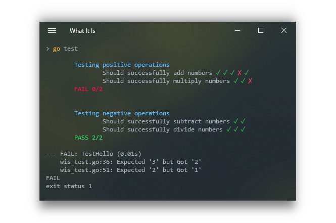

# What It Is

A simple set of helpers to structure your go tests and have pretty output

<p align='center'>
    
</p>

## Philosophy

I wanted a simple way to structure my tests in a way that _kinda sorta_ reads like english and have my test results reflect that. Yes go has sub tests, but the output isn't amazing. There are some **excellent** alternatives such as [Go Convey](https://github.com/smartystreets/goconvey) but it was a little overkill for what I needed and the terminal output on windows leaves a little to be desired. 🤷‍

**What**: To have the test read like english, you first determine what you're about to test. Eg. `What: Test that the millennium falcon flies`  
**It**: To explain what components you are testing within the millennium falcon, you express that it does something. Eg. `It: Will engage the Hyperdrive`  
**Is**: To assert that something is working or not, you _ask_ it. Eg. `Is: HyperdriveOutput EqualTo ExpectedHyperdriveOutput`  

## Usage

```go
 package myPackage

 import (
     "testing"
     . "github.com/jakehl/whatitis"
 )

 func Add(a, b int) int {
     return a + b
 }

 func Subtract(a, b int) {
     return a - b
 }

 func TestAdd(t * testing.T) {
     What(t, "Testing maths operations", func(w *WhatContext) {
         w.It("Should successfully add numbers", func(i *ItContext) {
             FirstActualOutput: = Add(100, 100)
             i.Is(FirstActualOutput, EqualTo, 200)
             // Pass
             SecondActualOutput: = Add(100, 900)
             i.Is(SecondActualOutput, EqualTo, 250)
             // Fail
         })
         w.It("Should successfully subtract numbers", func(i *ItContext) {
             FirstActualOutput: = Subtract(100, 100)
             i.Is(FirstActualOutput, EqualTo, 0)
             // Pass
             SecondActualOutput: = Subtract(100, 900)
             i.Is(SecondActualOutput, EqualTo, -800)
             // Pass
         })
     })
 }
```

## Comparators
Currently there are only two comparators: `EqualTo` and `NotEqualTo` however it is easy to write your own. Check out the implementations of the two mentioned to see how. I'll be adding more as I go.

## Known issues
Currently the test results are written to StdOut. This means that if you are testing anything that also writes to StdOut you'll see the output amongst the test results. I want a way to have the live tests results without affecting the output of items under test. I have tried outputting a static set of results at the end of each `What` section, but on time consuming tests its useful to have them show in real time.

## Inspirations
- [Go Convey](https://github.com/smartystreets/goconvey) Is an amazing testing tool and would definitely be my choice on larger projects. I took heavy inspiration from the way they handle assertions and their terminal output (on non windows platforms)
- [Jest](https://github.com/facebook/jest) is a testing framework for Javascript (*etc.*) that is second to none if you're working on a front end or node project. The `describe -> it/test` flow inspired the name and structure of this project  
